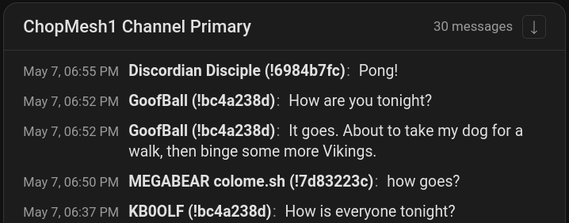

# Meshtastic Chat Card

A custom [Lovelace](https://www.home-assistant.io/dashboards/) card for [Home Assistant](https://www.home-assistant.io/) that displays Meshtastic channel messages recorded by the [`meshtastic` integration](https://github.com/meshtastic/home-assistant).

## Screenshots



## Features

- **History backfill** – on load, pulls up to 7 days of past messages from the HA logbook (`logbook/get_events`).
- **Send messages** – optional opt-in composer that sends to the configured channel via the integration's `meshtastic.broadcast_channel_message` service. Your own sent messages are echoed locally in the card for instant feedback; see [docs/sent-message-echo.md](docs/sent-message-echo.md) for the trade-offs (the echo is in-memory only and does not persist across reloads).

## Installation

### Prerequisites

> [!WARNING]
> Before using this card, please ensure you have the [Meshtastic integration](https://github.com/meshtastic/home-assistant) installed in your Home Assistant instance, with at least one gateway device exposing a channel entity (`device_class: channel`).

### HACS (Recommended)

1. Open HACS in your Home Assistant instance
2. Click the menu icon in the top right and select "Custom repositories"
3. Add this repository URL and select "Dashboard" as the category
   - `https://github.com/ch0ppy35/meshtastic-integration-chat-log-card`
4. Click "Install"
5. Reload your browser

### Manual Installation

1. Download the `meshtastic-chat-card.js` file from the [latest release](https://github.com/ch0ppy35/meshtastic-integration-chat-log-card/releases).
2. Copy it to your `www/community/meshtastic-chat-card/` folder.
3. Add the following to your `configuration.yaml` (or add as a resource in the Dashboards menu):

```yaml
lovelace:
  resources:
    - url: /local/community/meshtastic-chat-card/meshtastic-chat-card.js
      type: module
```

1. Reload your browser.

## Usage

Add the card to your dashboard using the UI editor or YAML:

### Card Editor

The card is fully configurable through the card editor, allowing you to customize:

- Channel entity selection (auto-discovers the primary Meshtastic channel)
- Card title
- Message limit
- Timestamp display
- Sort order
- Send composer (optional)

### YAML

This is the most minimal configuration needed to get started:

```yaml
type: custom:meshtastic-chat-card
channel_entity: meshtastic.my_gateway_channel_primary
```

### Configuration options

| Option            | Type      | Default | Description                                                                                                                                     |
| :---------------- | :-------- | :------ | :---------------------------------------------------------------------------------------------------------------------------------------------- |
| `channel_entity`  | `string`  | —       | **Required.** Entity ID of the Meshtastic channel to display (`device_class: channel`).                                                         |
| `title`           | `string`  | —       | Card title. Defaults to the channel entity's `friendly_name`.                                                                                   |
| `limit`           | `number`  | `200`   | Maximum number of messages to render. Oldest messages are dropped first.                                                                        |
| `show_timestamps` | `boolean` | `true`  | Show the date and time (for example, `May 7, 14:30`) at the start of each message row. Hover a row to see full second-level precision.          |
| `sort_order`      | `string`  | `desc`  | `desc` = newest messages first (top), `asc` = oldest messages first (bottom). The header button overrides this setting for the current session. |
| `enable_send`     | `boolean` | `false` | Show a composer at the top of the card to send messages to the configured channel via `meshtastic.broadcast_channel_message`.                   |

A 🔒 badge is always shown next to messages delivered via a PKI/direct encrypted link.

### Full YAML example

```yaml
type: custom:meshtastic-chat-card
channel_entity: meshtastic.my_gateway_channel_primary
title: 'Base Camp Chat'
limit: 100
show_timestamps: true
sort_order: desc
enable_send: true
```

### Finding Your Channel Entity

If you're unsure which channel entity to use, here are a couple of ways to find it:

#### Method 1: Use the Card Editor (Recommended)

1. Add the card through the visual editor
2. The editor will pre-select the primary Meshtastic channel entity if one exists
3. Click "Show Code Editor" to see the generated YAML and copy the `channel_entity` value

#### Method 2: Developer Tools

1. Go to **Developer Tools** → **States**
2. Filter for `meshtastic.` and look for entities with `device_class: channel`
3. Use the entity ID (e.g. `meshtastic.my_gateway_channel_primary`)

## Development

```bash
# Install dependencies
yarn install

# Start the dev rollup (rebuild on save, serves the bundle on :5001)
yarn start

# Production build → dist/meshtastic-chat-card.js
yarn build

# Type-check (uses tsconfig.test.json so test files are included)
yarn typecheck

# Lint
yarn lint
```

The dev build registers the card as `meshtastic-chat-card-dev` so it can coexist with the production card in the same HA instance. The `DEV` flag is injected at build time by `@rollup/plugin-replace` (`true` in `rollup.config.dev.js`, `false` in `rollup.config.js`) — no manual flipping required before cutting a release.

### Where the dev bundle is written

By default `yarn start` writes to `./dist-dev/meshtastic-chat-card.js`. To live-reload directly into a Home Assistant instance, point `DEV_OUTPUT_DIR` at your HA `www` directory:

```bash
DEV_OUTPUT_DIR=/path/to/homeassistant/config/www yarn start
```

Then in HA, register the resource at **Settings → Dashboards → Resources** as `/local/meshtastic-chat-card.js` with type **JavaScript module** ([HA docs](https://developers.home-assistant.io/docs/frontend/custom-ui/registering-resources)).

### Standalone preview page

For iterating on the UI without a Home Assistant instance, run the demo
harness:

```bash
yarn demo
```

This bundles the card plus a small preview page and serves it on
<http://localhost:5050>. The page mounts the card against a stubbed `hass`
object backed by mock logbook history, and exposes a controls panel for the
config options that matter most while developing:

- `title`, `limit`, `sort_order`, `show_timestamps`, `enable_send`
- Container width / height (HA's grid sizing doesn't apply on a vanilla page)
- An **Inject message** button that fires a fake `meshtastic_message_log`
  event so you can see the live-flash animation
- A **Replay history** button that rebuilds the mock logbook

Send a message with `enable_send` on and the harness echoes it back through
the live event stream and logs the `callService` payload to the browser
console — useful for verifying the full round-trip without a radio.

The harness lives in `demo/` and uses the same dev tag
(`meshtastic-chat-card-dev`) as `yarn start`, so it shares the dev build flag
behavior described above.

### Testing the live message path without a radio

The card subscribes to the `meshtastic_message_log` event bus. To exercise the live render path without a real Meshtastic gateway, fire a fake event from HA's **Developer Tools → Events**:

- Event type: `meshtastic_message_log`
- Event data:

  ```yaml
  entity_id: meshtastic.your_channel_entity
  from_name: Tester
  message: hello from devtools
  pki: false
  ```

### Testing

```bash
# Run the unit and component test suites
yarn test

# Watch mode
yarn test:watch

# Coverage report
yarn test:coverage
```

Tests live next to the source under `src/__tests__/` and use Jest with `ts-jest` (ESM mode). Pure helpers (`messages.ts`, `history.ts`, `discovery.ts`, `live.ts`) run in the default `node` environment; the Lit render smoke test opts into `jsdom` via a per-file docblock.
